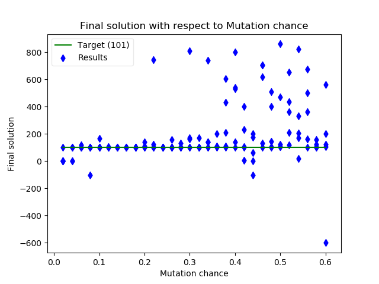
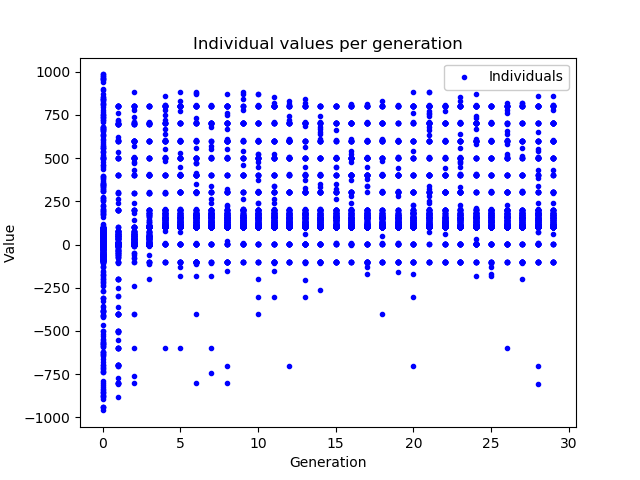

# Technical report

If this is hard to follow, use the `ReportLinked.pdf` instead; as this seperates each problem and metaheuristic using links.

## Problem 1

### Abstract


I defined this in the [problem_function](./modules/problem_function.py) module which I import in all my metaheuristics code.

It plots this graph:

")

### Best solution (found)

Where there is a local minimum (a very shallow one on this scale) at `x = 0` and a global minimum at `x = 101`; so the best solution is 101.

I find both of these minima when testing each of the metaheuristics. I have written the code to each metaheuristic and put it into the `metaheuristics` python module.

### Best metaheuristic

**Genetic algorithms** seem best suited to solving this problem as they find both minima to a high degree of accuracy and it doesn't take much computational power for this problem.

<hr />

## Solving problem 1 with Gradient Descent

_Source code: [notebook](./problem1/gradientDescent/gradientDescent.ipynb) or [python script](./problem1/gradientDescent/gradientDescent.py)_

Gradient descent is deterministic so doesn't need to be run more than once for the same parameters, because its going to yield the same results.

I have made a generalised `gradient_descent` function in the [metaheuristics module](./modules/metaheuristics.py).

### Gradient descent, with default parameters

With the [default](./problem1/gradientDescent/gradientDescent.py#L136) starting parameters, you get this:

")

When the algorithm starts it uses the derivative to find the gradient and follows the slope downward, until one of the tolerances (`e_g` gradient or `e_x` difference in x) are satisfied or the maximum iterations is reached.

### Algorithm by hand (first few iterations)

**Starting with these parameters:**

- x0 = 120
- max_i = 100
- step_m = 0.1
- e_g = 0.001
- e_x = 0.001

**Algorithm:**

- Set x = x0 ( = 120)
- Calculate the initial gradient (`g = 2*(120-101) = 38`)
- While either of the tolerances aren't satisfied (`xdiff > e_x || g > e_g`) or the maximum iterations isn't reached (`i < max_i`):
  - Calculate the new x value (`x = x - g*step_m = 120 - 38*0.1 = 116.2`)
  - Find the new gradient (`g = 2*(116.2-101) = 30.4`)

_See the notebook, for output of all of the iterations._

### Starting point (x0)

When testing how the starting point affects the gradient descent on this particular function it becomes apparent that gradent descent only works well from a particular set of start positions.


Below the value of the global minima the curve is very flat and has little gradient, so the algorithm has tiny steps and doesn't move very far (from where it starts) in the amount of iterations it has. But between 101 and 120 the algorithm consistently finds the global minimum at 101.

### Step multiplier

This is the proportion of the gradient that is subracted from the current x position.

Again doing 3 tests at x0 = 80, x0 = 101 and x0 = 120; this time I varied the step multiplier value between 1/21 and 20/21 (in increments of 1/21 for 20 times)

#### x0 = 80

")

Here the gradient is so small that the amount taken off of x each step is negligible; so the step multiplier has little effect, and the result is approximately `x0`.

#### x0 = 101

")

Here it seems that the stopcondition gets triggered immediently so the step multiplier doesn't have any effect, and the result is `x0`.

#### x0 = 120

")

Here there is a steep gradient so a smaller step multiplier is preferred over a larger one (`step_m < 0.6`) otherwise gradient descent overshoots the global minimum and carries on towards the local minimum.

### Difference tolerance (e_x)

Doing tests at x0 = 80, x0 = 101 and x0 = 120; the difference tolerance was varied from 0.05 to 1.00 (in 20 increments of 0.05).

#### x0 = 80

")

Again, (with the step multiplier only being 0.1) the difference at this shallow gradient was very small so the tolerance between this range was pretty much satisfied straight away.

#### x0 = 101

")

Similar to the last one, the difference tolerance was satisfied straight away (because of the small gradient) with the algorithm starting at a minimum.

#### x0 = 120

")

Because this part of the curve is much more steep, we actually get some movement from the GD algorithm. The correlation favours smaller values of tolerance for getting closer to the minimum.

### Gradient tolerance (e_g)

Doing tests at x0 = 80, x0 = 101 and x0 = 120; the gradient tolerance was varied from 0.05 to 2.00 (in 40 increments of 0.05).

The results were very similar to difference tolerance, however gradient tolerance values are a lot less sensitive in changing the result than difference tolerance.

#### x0 = 80

")

#### x0 = 101

")

#### x0 = 120

")

### Maximum iterations

The maximum iterations value limits how many times the GD algorithm can run when the tolerance values aren't met.

#### x0 = 80

")

As the tolerances are met straight away, iterations doesn't affect the GD at this start point on the curve.

#### x0 = 101

")

As the tolerances are met straight away, iterations doesn't affect the GD at this start point on the curve.

#### x0 = 120

")

The larger the maximum iterations the closer the result is to finding a satisfying the tolerance stop conditions, and getting a good final result.

### Conclusion

Gradient descent is a very simple deterministic algorithm which just follows a gradient down to a minimum.

Pros:

- Its not very computationally intensive and relatively fast, compared to other metaheuristics.
- Accurate when given the right parameters

Cons:

- Can't be used on functions which aren't continuous since it needs the derivative to find the gradient.
- Bad on curves with long shallow gradients, an requires really small or no tolerances and high numbers of iterations to get close to a minima.
- Will find the minima down the gradient to wherever is starts, which isn't neccesarily the global minimum.

<hr />

## Solving problem 1 with Simulated Annealing

_Source code: [notebook](./problem1/simulatedAnnealing/simulatedAnnealing.ipynb) or [python script](./problem1/simulatedAnnealing/simulatedAnnealing.py)_

Being stochastic, SA will create different results each time but they will be very similar with the same settings.

I have made a generalised `simulated_annealing` function in the [metaheuristics module](./modules/metaheuristics.py#L53).

### Simulated annealing, with default parameters

With the [default](./problem1/simulatedAnnealing/simulatedAnnealing.py#L142) starting parameters, you get something like this:

")

")

You can see that the simulated annealing can and does often start to overshoot but with the right parameters it eventually finds the global minimum. However, this isn't the case for a lot of combinations of parameters as we will see.

### The algorithm by hand (first few iterations)

Starting with the [default](./problem1/simulatedAnnealing/simulatedAnnealing.py#L142) parameters:

- `f`: the problem 1 function (imported from [problem_function](./modules/problem_function.py) module)
- `s_0`: 120
- `t_0`: 1000
- `neighbourhood_func`: returns the points either side of s by a step size of 0.1 (returns `[x - 0.1, x + 0.1]`)
- `temp_reduc_func`: returns 75% of the current temperature, `t`.
- `acc_prob_func`: uses the Boltzman distribution to return an acceptance probability of picking a "worse step" (Henderson. D, et al, 2003).
- `stop_cond`: returns `True` when the current iteration reaches the `max_i` variable.
- `max_i`: 50
- `max_epoch`: 50

_Further descriptions of what the parameters mean and how they are used in the algorithm can be found in the [source code](./problem1/simulatedAnnealing/simulatedAnnealing.py#L29)._

#### Algorithm workings

- Set up local variables
  - Iteration counter (`i`) = 0
  - Current solution (`s`) = `s_0`
  - Current temperature (`t`) = `t_0`
- Check stop condition _(`i` (0) is not equal to `max_i` (50))_ so do loop:
  - for number of epochs (`max_epoch`) do loop:
    - get neighbourhood: [119.9, 120.1]
    - pick one solution from the neighbourhood at random: s_1 = 120.1
    - find the difference of this f(s) from previous: f(s_1) - f(s_0) = 363.44 - 359.63 = 3.81
    - as diff < 0 is not true, calculate the acceptance probability: acc_prob = 1.00
    - get a random number (0.12) from 0-1, as acc_prob > random_number s_1 is accepted
  - repeat for epoch 2
    - get neighbourhood: [120, 120.2]
    - pick one solution from the neighbourhood at random: s_2 = 120
    - find the difference of this f(s) from previous: f(s_2) - f(s_1) = 359.63 - 363.44 = -3.81
    - as diff < 0 is true s_2 is accepted
  - repeat for epoch 3
    - get neighbourhood: [119.9 120.1]
    - pick one solution from the neighbourhood at random: s_3 = 119.9
    - find the difference of this f(s) from previous: f(s_3) - f(s_2) = 355.84 - 359.63 = -3.79
    - as diff < 0 is true s_3 is accepted
  - repeat for epoch 4
    - get neighbourhood: [119.8, 120]
    - pick one solution from the neighbourhood at random: s_4 = 120
    - find the difference of this f(s) from previous:f(s_4) - f(s_3) = 359.63 - 355.84 = 3.79
    - as diff < 0 is not true, calculate the acceptance probability: acc_prob = 1.00
    - get a random number (0.83) from 0-1, as acc_prob > random_number s_4 is accepted
  - ... _(after 50 epochs we get to something like 119.8 as at a high acceptance probability a step up and step down are both very likely)_
  - Reduce `t`: 1000 x 0.75 = 750
  - Increment iteration counter: `i = i + 1`
- Check stop condition _(`i` (1) is not equal to `max_i` (50))_ so do loop:
  - for number of epochs (`max_epoch`) do loop:
    - get neighbourhood: [119.7, 119.9]
    - pick one solution from the neighbourhood at random: s_1 = 119.7
    - find the difference of this f(s) from previous: f(s_1) - f(s_0) = 348.32 - 352.07 = -3.75
    - as diff < 0 is true, s_1 is accepted
  - repeat for epoch 2
    - get neighbourhood: [119.6, 119.8]
    - pick one solution from the neighbourhood at random: s_2 = 119.8
    - find the difference of this f(s) from previous: f(s_2) - f(s_1) = 352.07 - 348.32 = 3.75
    - as diff < 0 is not true, calculate the acceptance probability: acc_prob = 1.00
    - get a random number (0.79) from 0-1, as acc_prob > random_number s_2 is accepted
  - repeat for epoch 3
    - get neighbourhood: [119.7 119.9]
    - pick one solution from the neighbourhood at random: s_3 = 119.9
    - find the difference of this f(s) from previous: f(s_3) - f(s_2) = 355.84 - 352.07 = 3.77
    - as diff < 0 is not true, calculate the acceptance probability: acc_prob = 0.99
    - get a random number (0.99) from 0-1, as acc_prob > random_number s_3 is accepted
  - repeat for epoch 4
    - get neighbourhood: [119.8, 120]
    - pick one solution from the neighbourhood at random: s_4 = 120
    - find the difference of this f(s) from previous: f(s_4) - f(s_3) = 359.63 - 355.84 = 3.79
    - as diff < 0 is not true, calculate the acceptance probability: acc_prob = 0.99
    - get a random number (0.99) from 0-1, as acc_prob > random_number s_4 is accepted
  - ... _(after 50 epochs we get to something like 121.0 as at a high acceptance probability a step up and step down are both very likely)_
  - Reduce `t`: 750 x 0.75 = 562.5
  - Increment iteration counter: `i = i + 1`
- ... _And so on for 50 iterations_

_Over time the epochs will tend to choose decreasing values, minimising the difference, because the temperature will decrease and reduce the acceptance probability (of solutions with positive differences)._

See the notebook for a real log of the whole algorithm.

### Changing the starting point (s_0)

For this independant variable I tested a range of starting points from -5 to 120.


Values of 90 < x < 200 are a good start point for the model (with these other starting settings); however with a starting point of x < 90 the model does tend to fall towards the local minimum at x = 0, and with a start x > 200 the start point is too far from the solution with these parameters.

### Adjusting temperature variables (t_0 & the cooling function)

For this, since the gradient of the problem function at the starting point itself affects the general direction of where the simulated annealing will end up (as shown above), I did 3 batch tests with s_0: at 80, 101 and 120.

For this my independant variables were:

- The starting temperature, tested with 50 values from 1 to 981
- The gradient of the "linear" cooling function `c(x) -> gx` (where g is the temperature gradient), testing with 50 values from 1/52 to 50/52 (~0.02 to ~0.96)

#### s_0 = 80


- This shows that very very little simulated annealing attempts starting at 80 finished near 101.
- Start temperature didn't seem to have a big affect on the algorithm as the results for when a certain temperature gradient is constant are largely, very similar.
- Temperature gradient had a massive affect with:
  - `g < 0.5` creating a very quick cooling of temperature and intensifying the search (with very low acceptance probability for non minimising neighbour solutions).
  - `0.5 < g < 0.75` allows for a bit more diversification of the results but as these end up lower than 80 a net minimising towards the local min at 0 is taking place.
  - `g > 0.75` seems like there is very little temperature loss, creating random like results around 80 (start point) even for low starting temperatures (with the execption of temperatures where `t_0 < 10` it seems)


The above uses the same data but the z-axis is standard deviation from 101, to get some measure for accuracy of the test to the global minimum.

- This showed that even very extreme temperature settings couldn't compensate for the starting position at 80.

#### s_0 = 101 (starting at the global minimum)


- It seems that when you start near the global minimum irrespective of temperature the majority of results will stay nearby (for this function).
- Quite a few did jump out of the global minomum though and travel down towards the local minimum at 0.
- The temperature gradient again strongly influenced how far the solution moved from the start, with lower gradients travelling quite far to 0 and higher ones staying near to 101.
- Again starting temperature `t_0` didn't have much of an affect upon the end result, although it is more likely that for the first epochs high temperature models will jump out of the global minimum and might end up travelling to 0.


The above uses the same data but the z-axis is standard deviation from 101, to get some measure for accuracy of the test to the global minimum.

#### s_0 = 120


- The majority of results on this start will tend towards 101 because of the
- Start temperature didn't seem to have a big affect on the algorithm as the results for when a certain temperature gradient is constant are largely, very similar.
- Temperature gradient had a massive affect with:
  - `g < 0.5` creating a very quick cooling of temperature and intensifying the search (with very low acceptance probability for non minimising neighbour solutions).
  - `0.5 < g < 0.75` allows for a bit more diversification of the results but as these end up lower than 80 a net minimising towards the local min at 0 is taking place.#
  - `g > 0.75` seems like there is very little temperature loss, creating random like results around 80 (start point) even for low starting temperatures (with the execption of temperatures where `t_0 < 10` it seems)


The above uses the same data but the z-axis is standard deviation from 120, to get some measure for accuracy of the test to the global minimum.

### Neighbourhood function

So far, a neighbourhood of `[x - 0.1, x + 0.1]` has been used.

For this test I've adapted the neighbourhood function so that the parameters include a variable step size and variable amount of pairs of steps around x.

Such that:

- step size 0.1, with 2 pairs around x of 1 would yield: `[x - (2 x 0.1), x - (1 x 0.1), x + (1 x 0.1), x + (2 x 0.1)] = [0.8, 0.9, 1.1, 1.2]`
- step size 1, with 3 pairs around x of 5 would yield: `[x - (3 x 1), x - (2 x 1), x - (1 x 1), x + (1 x 1), x + (2 x 1), x + (3 x 1)] = [2, 3, 4, 6, 7, 8]`

Again, I did 3 batch tests with s_0 at: 80, 101 and 120.

#### s_0 = 80


Observations:

- The majority of results occur at 0 (a local minima)
- A combination of small step size and less neighbourhood pairs, decrease the search space around the starting point; so the end result is closer to the start. (you can see this because the result curves up towards 80 nearer to a step size of 0.00 & a neighbourhood pairs of 1)
- When the step size & neighbourhood becomes too large the results can become less reliable (the various outliers around a step of 1.75-2.00 and neighbourhood pairs of 6-10)


- The highest accuracy was from the small step size and small neighbourhood SA tests.
- Even with large neighbourhoods small step size can keep the results quite intensified around the start.

#### s_0 = 101


Observations:

- The majority of results again occur at 0 (a local minima), even though the tests started at a global minima
- There are a larger amount of results at the global minima though since tests started on the global minima


- The highest accuracy was from the small step size and small neighbourhood SA tests.
- Neighbourhood values of 2 with a smaller step perform best and steps closer to 0.1 with small neighbourhoods perform best. Otherwise results tend to jump out of the global minima and end up at the local minima.
- Large step size and large numbers of neighbourhood pairs again created outliers which didn't find any minima.

#### s_0 = 120


Observations:

- The majority of results again occur at 0 (a local minima)
- There are a larger amount of results at the global minima though since tests had to step past the global minima to get to the local minima.


- The highest accuracy was from the small step size and small neighbourhood SA tests.
- Neighbourhood values of 2 with a smaller step perform best and steps closer to 0.1 with small neighbourhoods perform best. Otherwise results tend to jump out of the global minima and end up at the local minima.
- Large step size and large numbers of neighbourhood pairs again created outliers which didn't find any minima.

### Stop condition

Up until now an iteration based stop condition has been used.

We will now experiment with various stop condition functions when batch tested over different max_epoch and max_iteration values, these stop conditions are:

- Stop when reaching max_iteration
- Stop when the `x` difference is less than 0.1 (step size) after an iteration of epochs
- Stop when the solution `f(x)` difference is less than 0.1

### Conclusion

The success of this algorithm in terms of success (at reaching a good solution) is quite consistent when the right parameters are chosen, however as what these are change depending upon the problem function, the accuracy of the method is not constant. I'd say the efficiency of this algorithm can be quite efficient again when favourable parameters are chosen, but it can take a large amount of iterations and epochs to get to a good solution (or it might not get to a good solution in time) when bad parameters are chosen.

Pros:

- Has the potential to find the global maximum from any starting position with the right parameters, since it is stocastic.
- Can be tuned to be more or less intensifying at different points and rates.

Cons:

- Since it is stocastic can overshoot minima, go the wrong direction and do other unfavourable behavour due to random chance. However, on average it will (with the right parameters) go in a favourable direction.
- Is quite computationally intensive, taking many iterations and using quite a complex model to optimise a function.

<hr />

## Solving problem 1 with Taboo Search

_Source code: [notebook](./problem1/tabooSearch/tabooSearch.ipynb) or [python script](./problem1/tabooSearch/tabooSearch.py)_

Taboo search is deterministic so doesn't need to be run more than once for the same parameters, because its going to yield the same results.

I have made a generalised `taboo_search` function in the [metaheuristics module](./modules/metaheuristics.py#L101).

### Taboo search, with default parameters

With the [default](./problem1/tabooSearch/tabooSearch.py#L81) starting parameters, you get this:


When the algorithm starts it finds the neighbours of the start position and selects the better neighbour using `f`. It carries on like this until reaching a minimum where it can't find a better neighbour and fills its taboo list with the neighbourhood before stopping, since there are no other viable neighbours.

### Algorithm by hand (first few iterations)

**With these starting parameters**

- s0 = 120
- taboo_memory = 5
- max_i = 300
- step_size = 0.1
- neighbourhood: s ± step_size (2 neighbours)
- stop_function: if max iterations is reached or there aren't any viable neighbours.

**Algorithm:**

- Set taboo list to just s0 (`taboo_list = [120]`)
- Repeat (until stop condition is satisfied):
  - Calculate the neighbourhood (`[s - step_size, s + step_size] = [119.9, 120.1]`)
  - Filter (remove) the neighbours which appear in the taboo list (none)
  - Sort the neighbourhood by the problem function. (`[119.9, 120.1]`)
  - If the best neighbour is better than the current `s` replace `s` with it. (`s = 119.9`)
  - Add best neighbour to taboo list, removing oldest if no memory left (`taboo_list = [120, 119.9]`)

### Starting point (s0)

Since this algorithm taboo's the current solution, there is no change of direction and the minimum that it finds will be the first one in that direction.

I tested starting positions from 80 - 120 in increments of 1.


With a starting position of 80 - 100, the algorithm heads towards the local minimum at x = 0 (but reaches the max iterations before it can).

Otherwise, with a starting position of between 101 - 120 the search finds the global minimum at x = 101.

### Max iterations

I tested 40 amounts of iterations from 5 to 200.

#### s0 = 80

")

Increasing the max iterations gets the final solution closer to `x = 0` (local min).

#### s0 = 101

")

Here there is no affect as the stop condition is acheived every time, because the start is in a minimum.

#### s0 = 120

")

Here 192 iterations are necessary for the stop condition to be met from a start at 120.

### Step size

I tested 40 step sizes from 0.05 to 2.

#### s0 = 80

")

The local minimum was reached when the step size got to 0.4 or greater (with a max_i of 200); but since the step size is not a multiplier but is the actual size of each difference per iteration, step sizes which didn't divide 80 evenly gave inaccurate results around the minimum.

#### s0 = 101

")

Here there is no affect as the algorithm doesn't step away from the minimum.

#### s0 = 120

")

In this case the global minimum isn't far away but since the difference from the start to the minimum is 19, the affects of a step size which doesn't divide perfectly into 19 is clearer about the minimum.

### Taboo memory

In this test I varied the maximum amount of values that could be stored in the taboo list per iteration. I tested between 1 and 4.

#### s0 = 80

")

#### s0 = 101

")

#### s0 = 120

")

As you can see memory in this case doesn't affect the end result since either the stop condition is reached or the maximum iterations are reached and we only need space for 2 values, 1 step away either side of the current position (for a 1 dimentional problem).

### Conclusion

Taboo search is very similar to gradient descent in its simplicity, and its deterministic nature.

Pros:

- It doesn't need a gradient to determine the direction to follow. So can deal with non-continuous functions.
- Not computationally intensive.

Cons:

- Only as accurate as the step size.
- Finds the closest minimum down the slope from where-ever it starts (with enough iterations)

<hr />

## Solving problem 1 with Genetic Algorithm

_Source code: [notebook](./problem1/geneticAlgorithm/geneticAlgorithm.ipynb) or [python script](./problem1/geneticAlgorithm/geneticAlgorithm.py)_

Being stochastic, GA's will create different results each time but they will be very similar with the same settings.

I have made a generalised `genetic_algorithm` function in the [metaheuristics module](./modules/metaheuristics.py#L139).

### Genetic algorithm, with default parameters

With the [default](./problem1/geneticAlgorithm/geneticAlgorithm.py#L197) starting parameters, you get something like this:

")

")

The early generations tend to have the fittest individuals closer to the local minima at 0, because the trough is more spread out so theres a higher probability that individuals will be their when they are initially randomly generated. However, with cross-over and mutation there start to be more individuals which find the global minima at 101 and because these then become the fittest more individuals in later generations settle at the global minimum.

### The algorithm by hand (first few iterations)

Starting with the [default](./problem1/geneticAlgorithm/geneticAlgorithm.py#L197) parameters:

- `population_size`: the population size per generation.
- `epochs`: the amount of epochs or generations of individuals. An [individual](./modules/metaheuristics.py#L133) is a class which I made to store the dna, generation and value of an instance of the population.
- `fitness_upper_bound`: The proportion of the population which survive to breed.
- `selection_function`: The way which couples of individuals are selected to pass down their dna.
- `mutation_chance`: The chance that a digit in the dna of an individual can randomly change from its parents.
- `sign_change_chance`: The chance that the sign part of the dna of an individual can randomly change from its parents.
- `cross_over_amount`: The amount of cross over that occurs when dna is combined from parent individuals.

Here are some constants which will be unchanged throughout as they are fundamental about GA's and the problem:

- `fitness_function`: the problem 1 function (imported from [problem_function](./modules/problem_function.py) module)
- `breed_individuals`: the function ([source](./modules/metaheuristics.py)) which unpacks the generation and dna from 2 individuals and first uses cross-over and then mutation on them to output a new individual with inherited dna and an incremented generation number.

#### Representing the decimal values as dna

In GA's the values of a problem need to be partitioned into many units, this is so that cross-over and mutation can create new values by making slight changes to this structure.

I first considered using binary and as I wanted to represent real numbers in my search space I tried implementing a floating point binary dna structure.


(Float diagram, see references)

What became clear though was that the search space would be very large and that a small change in 1 bit of a float can dramatically change the value of the float; especially in the first 2 bytes of it. Also there was the problem that cross-over between floats of with different exponents would create values wildly different to the original values.

Instead I decided to use a much more simplistic character array dna structure (1 sign, 1 decimal place and 6 digits).

`["s", "x", "x", "x", ".", "x", "x", "x"]`

(where `x` are digits, `s` is the sign and the `.` is the decimal place)

So: `-111.222` would be `["-", "1", "1", "1", ".", "2", "2", "2"]`

With this system I have a search space between -999.999 and 999.999 which is accurate to 3 decimal places; which is fine for the problem.

#### Mutation

In a GA for it to diversify there needs to be a slight chance of a mutation in the dna.

The mutation function I use has some chance (`sign_change_chance`) that the sign character will change to the other sign character, and another chance (`mutation_chance`) that is applied to each digit character that that character will change to another random character.

#### Cross-over

In a GA cross-over is how 2 dna structures pass down some of their data to the next generation.

Random cross-over points are selected and a one of the dna strands is picked randomly to start with.

Then the data of the selected strand is copied into a new stand until a cross-over point is reached where dna is instead copied from the other strand.

#### Example by hand of the GA

For the example I'll use a population size of 6 and a cross-over amount of 2.

- Create a population of random starting values in the search space.
  - `[0.100, 300.500, 120.000, 23.540, -964.000, -63.902]` (for example)
- For the amount of epochs/generations:
  - Sort the population by their value through with the fitness function.
    - fitnesses: `[-1.000, 39798.882, 359.632, -0.946, 0.000, -0.665]`
    - so sorted values are: `[0.100, 23.540, -63.902, -964.000, 120.000, 300.500]`
  - Remove the individuals from the population which are under the pass criteria (set by the `fitness_upper_bound`)
    - lets say that fitness upper-bound is top 4/6 so: `[0.100, 23.540, -63.902, -964.000]`
  - Then for the remaining population produce 6 new offspring by having 2 couples produce `2/fitness_upper_bound` offspring each (so 3).
    - selecting `0.100` and `23.540`
      - cross-over yields `3.500`
      - mutation changes this to `103.500`
      - The fore-mentioned happens another 2 times to produce: `103.500`, `23.1` and `0.34`
    - selecting `-63.902` and `-964.000`
      - cross-over yields `-963.900`
      - mutation changes this to `-903.900`
      - The fore-mentioned happens another 2 times to produce: `-903.900`, `-63.000` and `-974.002`
  - The next generations population is `[103.500, 23.1, 0.34, -903.900, -63.000, -974.002]` which replaces the old one.

### Population size

Through testing the GA when changing only population size I have found that larger populations (around 800 individuals or more) tend to get the best results. However, when you increase the number of individuals computation increases making it more time consuming.


Therefore, I decided in subsequent tests to fix my popultion size parameter at 1000 because I can be fairly sure that I'm getting a good result and increasing the population past this would only make the algorithm slower.

### Fitness upper-bound

This is a parameter that I have made up, in my GA design I have a sortof [truncation selection](http://nitro.biosci.arizona.edu/zbook/NewVolume_2/pdf/WLChapter14.pdf), what I use it for is the percentage of the population which get a chance to be selected (keeping the fittest and removing the rest).

When my default selection function is used, the GA is using truncation selection; since my default selection function will choose all of the remaining population after the truncation.

I found that I got a high proportion of results at the global minima when the "fitness upper-bound" was less than 30% and I got a high proportion of results at the local minima when it was greater than 70%.


In subsequent tests I fixed fitness upper-bound to 0.2.

### Number of Epochs / Generations

The number of generations of populations produced.


I found that testing from 15-150 generations didn't affect the results significantly. I fixed the number of epochs at 30 for subseqent tests.

### Cross-over amount

For this I varied the amount of cross-over, between none and 5; running 5 GAs for each.

I found that cross-over values of 1 and 2 performed best with my dna model, but not by much; because the results didn't correlate very well at all.


I fixed cross-over to 1 for subsequent tests.

### Mutation chance

This time I varied the chance that any digit character in the dna structure can randomly change.

I found that a balance is necessary where percentages 5% or lower tend to not be enough to find to global minimum, percentages higher than 15% would tend to give end results which were less accurate (didn't land on any minima); but percentages around 10% tend to find the global minimum more consistantly.



I fixed mutation chance to 0.1 (10%) following these findings.

### Selection method

_Note: generations in this algorithm start counting from 0_

I wrote 3 selection functions based upon selection methods I researched online (Blinkie and Thiele, 1995), they are:

- Truncation selection (the default one I use)
- Fitness proportionate selection
- Tournament selection

#### Truncation selection

After 16 generations the high density of the population shifts upto the global minimum from the local minimum.


#### Fitness proportionate selection

After 12 generations the high density of the population shifts upto the global minimum from the local minimum.


#### Tournament selection

After 5 generations the high density of the population shifts upto the global minimum from the local minimum.



Thus tournament selection seems to be the best selection method since it finds the best solution in the least amount of generations.

### Conclusion

GA's although computationally expensive, don't get easily trapped in local minima and don't suffer from the problem of where to start like other methods do, since it is population based; as the population affectively starts spread out across the entire search space.

To summarise, the best parameters for the GA over testing were:

1. A large but not excessive **population size** (around **1000** individuals)
2. I decided to truncate my population by the **fittest 20%** (200 individuals) for the next generation produced 10 children per 100 pairs of parents; to maintain population size.
3. The **number of generations** didn't need to be very large for this due to the population size and other factors so I reduced the number of epochs/generations **from 50 to 30**, as this reduced the amount of computation for the rest of the batch tests.
4. The amount of **cross over** was most consistent at **1**.
5. The chance of **mutation** didn't need to be high at all with a **chance of 10%** being about right.
6. The **selection function** quickest at zoning in the population on the global maximum was the **tournament selection** function.

To further improve this GA I would make a better mutation function which would mean a less eratic change in the values encoded by the dna structure.

Pros:

- Finds both local minima / isn't prone to getting trapped by local minima.
- Can intensify and diversify simultaniously with its population, since the mutated individuals will create more diverse answers but the cross over effect will create a more local shift in the values.

Cons:

- The most computationally intensive metaheuristic we've used.
- Much of the population will revisit large sections of the search space which aren't worthwhile due to the randomness of the mutation, with the other methods this was a lot less of a problem and they quickly narrowed the search to a particular area of the search space.

<hr />

## Problem 2

### Summary

In a cloth factory there are 4 types of cloth to produce (A, B, C and D), producing a type of cloth requires a combination of different amounts of coloured wool and there is a finite amount of each wool.

| Wool colour | A   | B   | C   | D   | Wool available |
| ----------- | --- | --- | --- | --- | -------------- |
| Green       | 1   | 2   | 1   | 1   | 10             |
| Red         | 2   | 1   | 2   | 1   | 6              |
| Blue        | 3   | 1   | 0   | 0   | 10             |
| Yellow      | 1   | 4   | 0   | 0   | 18             |
| Brown       | 0   | 0   | 1   | 3   | 8              |
| Purple      | 0   | 0   | 3   | 3   | 12             |

The different cloths yield different amounts of profit

| Cloth | Profit |
| ----- | ------ |
| A     | 3      |
| B     | 5      |
| C     | 4      |
| D     | 1      |

These can be modelled into the following Linear Programming model:


### Best solution (found)

The best solution I've found during testing has been **A = 0.0, B = 4.5, C = 0.75 & D = 0.0** for a profit of **25.5**. This is also the solution which I found by running simplex on the problem ([see notebook](./problem2/simplex.ipynb)).

Only Taboo Search and Genetic Algorithms found this answer out of the metaheuristics I used.

### Best metaheuristic

**Taboo search** consistently finds the best solution (with the right parameters) with very little computational power needed. The next best was GA but this required high computation and it wasn't 100% accurate.

<hr />

## Solving problem 2 with Gradient Descent

_Source code: [notebook](./gradientDescent/gradientDescent.ipynb) or [python script](./gradientDescent/gradientDescent.py)_

Gradient descent is deterministic so doesn't need to be run more than once for the same parameters, because its going to yield the same results.

### Abstract

The best solution I've found from GD has been A = 1.2, B = 2.0, C = 1.6, D = 0.4 making a profit of 15.3. This is the solution of the algorithm from a starting position of (0, 0, 0, 0).

#### Default gradient descent

With the [default](./gradientDescent/gradientDescent.py#L106) starting parameters, you get something like this:

```
----------------------------------------------------------------------------------
Iteration             X                         g	        diff
Start (0)             (0, 0, 0, 0)	        (3, 5, 4, 1)	N/A
1		      (0.3, 0.5, 0.4, 0.1)	(3, 5, 4, 1)	0.714
2		      (0.6, 1.0, 0.8, 0.2)	(3, 5, 4, 1)	0.714
3		      (0.9, 1.5, 1.2, 0.3)	(3, 5, 4, 1)	0.714
4		      (1.2, 2.0, 1.6, 0.4)	(3, 5, 4, 1)	0.714

x1 not -ve constraint: 0 <= 0.9
x2 not -ve constraint: 0 <= 1.5
x3 not -ve constraint: 0 <= 1.2
x4 not -ve constraint: 0 <= 0.3
green constraint: 5.4 <= 10
red constraint: 6.0 <= 6
blue constraint: 4.2 <= 10
yellow constraint: 6.9 <= 18
brown constraint: 2.1 <= 8
purple constraint: 4.5 <= 12
Profit:  15.3
```

Gradient descent on a linear multivariable function gives you partial derivatives which are constants. So you don't have a decreasing step size and you don't have the stop condition being satisfied until either a constraint is being hit or the maximum iterations has been reached; not from a gradient or difference tolerance being reached.

### Changing starting point

For this independant variable I tested a range of starting points in a spiral shape from (0, 0, 0, 0) outwards over 1000 points.

When it gave answers which were infeasible, because the algorithm started outside the feasible region, the profit was set to 0.


The best starting position is (0, 0, 0, 0)

### Changing step multiplier

I tested 100 step_m values from 0.01 to 1.0.

Again, infeasible answers were set to 0.


0.01, 0.02, 0.03, 0.05, 0.06, 0.1, 0.15 and 0.3 give you the profit of 15.3. The rest get you lower profits from the end of the feasible region being undershot.

### Conclusion

Because of the linear nature of the profit line, the constant gradient in the gradient descent algorithm removes a large amount of the effectivness of this algorithm.

It just goes in one direction until the constraints are hit and the algorithm has no way of following the edge of this feasible region until it finds a path further up the profit function.

<hr />

## Solving problem 2 with Simulated Annealing

_Source code: [notebook](./problem2/simulatedAnnealing/simulatedAnnealing.ipynb) or [python script](./problem2/simulatedAnnealing/simulatedAnnealing.py)_

Being stochastic, SA will create different results each time but they will be very similar with the same settings.

### Abstract

The best solution I've found from running SA has been:
A = 0.3, B = 2.9, C = 1.1, D = 0.1 making a profit of 19.9; when I was testing starting position and looked into the highest profit value.

### Simulated annealing with default starting parameters

With the [default](./problem2/simulatedAnnealing/simulatedAnnealing.py#L102) starting parameters, you get something like this:

```
----------------------------------------------------------------------------------
s_0: {'x3': 0, 'x4': 0, 'x1': 0, 'x2': 0}

Epoch: 1  s: {'x3': -0.1, 'x4': 0, 'x1': 0, 'x2': 0}        t: 5.0  Accepted: True  Diff: -0.4
Epoch: 2  s: {'x3': -0.1, 'x4': 0.1, 'x1': 0, 'x2': 0}      t: 5.0  Accepted: True  Diff: 0.1
Epoch: 3  s: {'x3': -0.1, 'x4': 0.1, 'x1': -0.1, 'x2': 0}   t: 5.0  Accepted: True  Diff: -0.3
Epoch: 4  s: {'x3': 0.0, 'x4': 0.1, 'x1': -0.1, 'x2': 0}    t: 5.0  Accepted: True  Diff: 0.4
Epoch: 5  s: {'x3': 0.0, 'x4': 0.0, 'x1': -0.1, 'x2': 0}    t: 5.0  Accepted: True  Diff: -0.1
Epoch: 6  s: {'x3': 0.1, 'x4': 0.0, 'x1': -0.1, 'x2': 0}    t: 5.0  Accepted: True  Diff: 0.4
Epoch: 7  s: {'x3': 0.1, 'x4': 0.0, 'x1': -0.2, 'x2': 0}    t: 5.0  Accepted: True  Diff: -0.3
Epoch: 8  s: {'x3': 0.1, 'x4': 0.1, 'x1': -0.2, 'x2': 0}    t: 5.0  Accepted: True  Diff: 0.1
(x1 not -ve constraint fails)

{'x1': 0, 'x2': 0, 'x3': 0, 'x4': 0}
```

Simulated annealing in this problem is a lot more prone to random walk (we can see this by the rate of "Accepted" answers which have a negative difference). This is because the difference of a step are so low (±0.5 at most), however the step size cannot be increased too much since the search space is quite small.

### Changing the starting point

For this independant variable I tested a range of starting points in a spiral shape from (0, 0, 0, 0) outwards over 1000 points. Each point was repeated 20 times (as the algorithm is stochastic) to get a general idea of consistency.

When it gave answers which were infeasible, because the algorithm started outside the feasible region, the profit was set to 0.


Good starting points (with profit above 16) included:

| Starting point           | End point            | Profit |
| ------------------------ | -------------------- | ------ |
| 754 (1.0, 1.0, 1.0, 0.4) | (0.5, 1.7, 0.8, 0.0) | 17.2   |
| 270 (0.6, 0.0, 0.6, 0.6) | (0.7, 0.3, 0.1, 0.4) | 16.3   |
| 269 (0.6, 0.1, 0.6, 0.6) | (0.6, 0.6, 0.2, 0.1) | 17.4   |

Average starting point: (0.733, 0.367, 0.733, 0.533)

Decided to round upto (0.7, 0.7, 0.7, 0.7) for future tests.

### Changing starting temperature and temperature change

I tested 40 different gradients from 1/41 to 1 and I tested for each of those 30 starting temperatures from 0.2 to 6.

Each combination was repeated 10 times so that an overall trend could be observed.


From the data, we can see that:

- Average profit was around 12.
- There was a much wider range of results as the temperature gradient increased.
- Start temperatures of less than 1 were the most consistent, however this is not where you tend find the best results.

I decided to use a high temperature gradient of 0.9 and a low starting temperature of 2, so that I had a slower increase of intensification from an already intenisfied starting temperature.

### Amount of epochs and step size

I decided to test the amount of epochs and step size together because per iteration these both contribute to the overall difference in profit because of the amount of movement of the solution.

I tested epoch amounts from 5 to 30 and for each of these tested step sizes from 1/40 to 3/4 (in increments of 1/40).

I repeated each combination 10 times.


I have found that the most consistently good results have been found where there is low epochs per iteration and a small step size.

I fixed epochs to 10 and step size to 0.1.

### Final run with improved parameters

```
----------------------------------------------------------------------------------
s_0: {'x4': 0.7, 'x2': 0.7, 'x3': 0.7, 'x1': 0.7}
Epoch: 1	s: {'x4': 0.7, 'x2': 0.7, 'x1': 0.6, 'x3': 0.7}    	t: 2	Accepted: True	Diff: -0.3
Epoch: 2	s: {'x4': 0.7, 'x2': 0.7, 'x1': 0.6, 'x3': 0.8}    	t: 2	Accepted: True	Diff: 0.4
Epoch: 3	s: {'x4': 0.7, 'x2': 0.6, 'x1': 0.6, 'x3': 0.8}    	t: 2	Accepted: True	Diff: -0.5
Epoch: 4	s: {'x4': 0.7, 'x2': 0.5, 'x1': 0.6, 'x3': 0.8}    	t: 2	Accepted: True	Diff: -0.5
Epoch: 5	s: {'x4': 0.8, 'x2': 0.5, 'x1': 0.6, 'x3': 0.8}    	t: 2	Accepted: True	Diff: 0.1
Epoch: 6	s: {'x4': 0.8, 'x2': 0.4, 'x1': 0.6, 'x3': 0.8}    	t: 2	Accepted: False	Diff: -0.5
Epoch: 7	s: {'x4': 0.8, 'x2': 0.4, 'x1': 0.6, 'x3': 0.8}    	t: 2	Accepted: True	Diff: -0.5
Epoch: 8	s: {'x4': 0.9, 'x2': 0.4, 'x1': 0.6, 'x3': 0.8}    	t: 2	Accepted: True	Diff: 0.1
Epoch: 9	s: {'x4': 0.9, 'x2': 0.4, 'x1': 0.5, 'x3': 0.8}    	t: 2	Accepted: True	Diff: -0.3
Epoch: 10	s: {'x4': 0.9, 'x2': 0.4, 'x1': 0.5, 'x3': 0.9}    	t: 2	Accepted: True	Diff: 0.4
----------------------------------------------------------------------------------
s_1: {'x4': 0.9, 'x2': 0.4, 'x3': 0.9, 'x1': 0.5}
Epoch: 1	s: {'x4': 0.9, 'x2': 0.5, 'x1': 0.5, 'x3': 0.9}    	t: 1.8	Accepted: True	Diff: 0.5
Epoch: 2	s: {'x4': 0.9, 'x2': 0.5, 'x1': 0.5, 'x3': 0.8}    	t: 1.8	Accepted: True	Diff: -0.4
Epoch: 3	s: {'x4': 0.9, 'x2': 0.5, 'x1': 0.6, 'x3': 0.8}    	t: 1.8	Accepted: True	Diff: 0.3
Epoch: 4	s: {'x4': 0.9, 'x2': 0.4, 'x1': 0.6, 'x3': 0.8}    	t: 1.8	Accepted: True	Diff: -0.5
Epoch: 5	s: {'x4': 1.0, 'x2': 0.4, 'x1': 0.6, 'x3': 0.8}    	t: 1.8	Accepted: True	Diff: 0.1
Epoch: 6	s: {'x4': 1.0, 'x2': 0.5, 'x1': 0.6, 'x3': 0.8}    	t: 1.8	Accepted: True	Diff: 0.5
Epoch: 7	s: {'x4': 1.0, 'x2': 0.5, 'x1': 0.5, 'x3': 0.8}    	t: 1.8	Accepted: True	Diff: -0.3
Epoch: 8	s: {'x4': 1.0, 'x2': 0.5, 'x1': 0.5, 'x3': 0.9}    	t: 1.8	Accepted: True	Diff: 0.4
Epoch: 9	s: {'x4': 1.1, 'x2': 0.5, 'x1': 0.5, 'x3': 0.9}    	t: 1.8	Accepted: True	Diff: 0.1
Epoch: 10	s: {'x4': 1.1, 'x2': 0.6, 'x1': 0.5, 'x3': 0.9}    	t: 1.8	Accepted: True	Diff: 0.5
----------------------------------------------------------------------------------
s_2: {'x4': 1.1, 'x2': 0.6, 'x3': 0.9, 'x1': 0.5}
Epoch: 1	s: {'x4': 1.1, 'x2': 0.6, 'x1': 0.4, 'x3': 0.9}    	t: 1.62	Accepted: False	Diff: -0.3
Epoch: 2	s: {'x4': 1.1, 'x2': 0.5, 'x1': 0.5, 'x3': 0.9}    	t: 1.62	Accepted: False	Diff: -0.5
Epoch: 3	s: {'x4': 1.1, 'x2': 0.6, 'x1': 0.5, 'x3': 0.8}    	t: 1.62	Accepted: True	Diff: -0.4
Epoch: 4	s: {'x4': 1.1, 'x2': 0.5, 'x1': 0.5, 'x3': 0.8}    	t: 1.62	Accepted: True	Diff: -0.5
Epoch: 5	s: {'x4': 1.1, 'x2': 0.5, 'x1': 0.5, 'x3': 0.9}    	t: 1.62	Accepted: True	Diff: 0.4
Epoch: 6	s: {'x4': 1.1, 'x2': 0.5, 'x1': 0.6, 'x3': 0.9}    	t: 1.62	Accepted: True	Diff: 0.3
Epoch: 7	s: {'x4': 1.1, 'x2': 0.4, 'x1': 0.6, 'x3': 0.9}    	t: 1.62	Accepted: True	Diff: -0.5
Epoch: 8	s: {'x4': 1.1, 'x2': 0.5, 'x1': 0.6, 'x3': 0.9}    	t: 1.62	Accepted: True	Diff: 0.5
Epoch: 9	s: {'x4': 1.1, 'x2': 0.5, 'x1': 0.5, 'x3': 0.9}    	t: 1.62	Accepted: True	Diff: -0.3
Epoch: 10	s: {'x4': 1.1, 'x2': 0.5, 'x1': 0.5, 'x3': 1.0}    	t: 1.62	Accepted: True	Diff: 0.4
----------------------------------------------------------------------------------
s_3: {'x4': 1.1, 'x2': 0.5, 'x3': 1.0, 'x1': 0.5}
Epoch: 1	s: {'x4': 1.2, 'x2': 0.5, 'x1': 0.5, 'x3': 1.0}    	t: 1.458	Accepted: True	Diff: 0.1
Epoch: 2	s: {'x4': 1.2, 'x2': 0.6, 'x1': 0.5, 'x3': 1.0}    	t: 1.458	Accepted: True	Diff: 0.5
Epoch: 3	s: {'x4': 1.1, 'x2': 0.6, 'x1': 0.5, 'x3': 1.0}    	t: 1.458	Accepted: True	Diff: -0.1
Epoch: 4	s: {'x4': 1.1, 'x2': 0.6, 'x1': 0.5, 'x3': 0.9}    	t: 1.458	Accepted: False	Diff: -0.4
Epoch: 5	s: {'x4': 1.1, 'x2': 0.6, 'x1': 0.5, 'x3': 1.1}    	t: 1.458	Accepted: True	Diff: 0.4
Epoch: 6	s: {'x4': 1.1, 'x2': 0.6, 'x1': 0.4, 'x3': 1.1}    	t: 1.458	Accepted: True	Diff: -0.3
Epoch: 7	s: {'x4': 1.1, 'x2': 0.6, 'x1': 0.4, 'x3': 1.2}    	t: 1.458	Accepted: True	Diff: 0.4
Epoch: 8	s: {'x4': 1.2, 'x2': 0.6, 'x1': 0.4, 'x3': 1.2}    	t: 1.458	Accepted: True	Diff: 0.1
Epoch: 9	s: {'x4': 1.2, 'x2': 0.5, 'x1': 0.4, 'x3': 1.2}    	t: 1.458	Accepted: True	Diff: -0.5
Epoch: 10	s: {'x4': 1.3, 'x2': 0.5, 'x1': 0.4, 'x3': 1.2}    	t: 1.458	Accepted: True	Diff: 0.1
----------------------------------------------------------------------------------
s_4: {'x4': 1.3, 'x2': 0.5, 'x3': 1.2, 'x1': 0.4}
Epoch: 1	s: {'x4': 1.3, 'x2': 0.5, 'x1': 0.4, 'x3': 1.3}    	t: 1.312	Accepted: True	Diff: 0.4
Epoch: 2	s: {'x4': 1.3, 'x2': 0.5, 'x1': 0.3, 'x3': 1.3}    	t: 1.312	Accepted: True	Diff: -0.3
Epoch: 3	s: {'x4': 1.3, 'x2': 0.4, 'x1': 0.3, 'x3': 1.3}    	t: 1.312	Accepted: True	Diff: -0.5
Epoch: 4	s: {'x4': 1.3, 'x2': 0.4, 'x1': 0.3, 'x3': 1.4}    	t: 1.312	Accepted: True	Diff: 0.4
Epoch: 5	s: {'x4': 1.3, 'x2': 0.3, 'x1': 0.3, 'x3': 1.4}    	t: 1.312	Accepted: False	Diff: -0.5
Epoch: 6	s: {'x4': 1.3, 'x2': 0.4, 'x1': 0.2, 'x3': 1.4}    	t: 1.312	Accepted: True	Diff: -0.3
Epoch: 7	s: {'x4': 1.2, 'x2': 0.4, 'x1': 0.2, 'x3': 1.4}    	t: 1.312	Accepted: True	Diff: -0.1
Epoch: 8	s: {'x4': 1.2, 'x2': 0.5, 'x1': 0.2, 'x3': 1.4}    	t: 1.312	Accepted: True	Diff: 0.5
Epoch: 9	s: {'x4': 1.2, 'x2': 0.5, 'x1': 0.1, 'x3': 1.4}    	t: 1.312	Accepted: True	Diff: -0.3
Epoch: 10	s: {'x4': 1.2, 'x2': 0.5, 'x1': 0.1, 'x3': 1.5}    	t: 1.312	Accepted: True	Diff: 0.4
----------------------------------------------------------------------------------
s_5: {'x4': 1.2, 'x2': 0.5, 'x3': 1.5, 'x1': 0.1}
Epoch: 1	s: {'x4': 1.2, 'x2': 0.6, 'x1': 0.1, 'x3': 1.5}    	t: 1.181	Accepted: True	Diff: 0.5
Epoch: 2	s: {'x4': 1.2, 'x2': 0.6, 'x1': 0.1, 'x3': 1.6}    	t: 1.181	Accepted: True	Diff: 0.4
Epoch: 3	s: {'x4': 1.2, 'x2': 0.6, 'x1': 0.2, 'x3': 1.6}    	t: 1.181	Accepted: True	Diff: 0.3
Epoch: 4	s: {'x4': 1.2, 'x2': 0.6, 'x1': 0.2, 'x3': 1.7}    	t: 1.181	Accepted: True	Diff: 0.4
Epoch: 5	s: {'x4': 1.2, 'x2': 0.6, 'x1': 0.2, 'x3': 1.6}    	t: 1.181	Accepted: True	Diff: -0.4
Epoch: 6	s: {'x4': 1.2, 'x2': 0.7, 'x1': 0.2, 'x3': 1.6}    	t: 1.181	Accepted: True	Diff: 0.5
Epoch: 7	s: {'x4': 1.2, 'x2': 0.7, 'x1': 0.1, 'x3': 1.6}    	t: 1.181	Accepted: True	Diff: -0.3
Epoch: 8	s: {'x4': 1.2, 'x2': 0.7, 'x1': 0.1, 'x3': 1.5}    	t: 1.181	Accepted: False	Diff: -0.4
Epoch: 9	s: {'x4': 1.2, 'x2': 0.7, 'x1': 0.1, 'x3': 1.7}    	t: 1.181	Accepted: True	Diff: 0.4
Epoch: 10	s: {'x4': 1.1, 'x2': 0.7, 'x1': 0.1, 'x3': 1.7}    	t: 1.181	Accepted: True	Diff: -0.1
----------------------------------------------------------------------------------
s_6: {'x4': 1.1, 'x2': 0.7, 'x3': 1.7, 'x1': 0.1}
Epoch: 1	s: {'x4': 1.1, 'x2': 0.8, 'x1': 0.1, 'x3': 1.7}    	t: 1.063	Accepted: True	Diff: 0.5
Epoch: 2	s: {'x4': 1.1, 'x2': 0.7, 'x1': 0.1, 'x3': 1.7}    	t: 1.063	Accepted: True	Diff: -0.5
Epoch: 3	s: {'x4': 1.1, 'x2': 0.6, 'x1': 0.1, 'x3': 1.7}    	t: 1.063	Accepted: False	Diff: -0.5
Epoch: 4	s: {'x4': 1.2, 'x2': 0.7, 'x1': 0.1, 'x3': 1.7}    	t: 1.063	Accepted: True	Diff: 0.1
Epoch: 5	s: {'x4': 1.1, 'x2': 0.7, 'x1': 0.1, 'x3': 1.7}    	t: 1.063	Accepted: True	Diff: -0.1
Epoch: 6	s: {'x4': 1.2, 'x2': 0.7, 'x1': 0.1, 'x3': 1.7}    	t: 1.063	Accepted: True	Diff: 0.1
Epoch: 7	s: {'x4': 1.2, 'x2': 0.8, 'x1': 0.1, 'x3': 1.7}    	t: 1.063	Accepted: True	Diff: 0.5
Epoch: 8	s: {'x4': 1.2, 'x2': 0.8, 'x1': 0.1, 'x3': 1.8}    	t: 1.063	Accepted: True	Diff: 0.4
Epoch: 9	s: {'x4': 1.2, 'x2': 0.7, 'x1': 0.1, 'x3': 1.8}    	t: 1.063	Accepted: False	Diff: -0.5
Epoch: 10	s: {'x4': 1.2, 'x2': 0.8, 'x1': 0.1, 'x3': 1.9}    	t: 1.063	Accepted: True	Diff: 0.4
(red constraint fails)

Stats:
x1 not -ve constraint: 0 <= 0.10000000000000003
x2 not -ve constraint: 0 <= 0.7
x3 not -ve constraint: 0 <= 1.7000000000000004
x4 not -ve constraint: 0 <= 1.0999999999999999
green constraint: 4.3 <= 10
red constraint: 5.4 <= 6
blue constraint: 1.0 <= 10
yellow constraint: 2.9 <= 18
brown constraint: 5.0 <= 8
purple constraint: 8.4 <= 12

Profit: 11.700000000000001
Solution: [0.1, 0.7, 1.7, 1.1]
```

### Conclusion

Although I managed to tune the parameters to fail and stop on a wool constraint instead of a non negative constraint; the simulated annealing algorithm seems to still be very inconsistent in finding good profit values.

Pros:

- Fairly quick.
- Can be tuned to increase intensification.

Cons:

- Generally very inaccurate.
- With small differences acts very randomly.

<hr />

## Solving problem 2 with Taboo Search

_Source code: [notebook](./problem2/tabooSearch/simulatedAnnealing.ipynb) or [python script](./problem2/tabooSearch/simulatedAnnealing.py)_

Taboo search is deterministic so doesn't need to be run more than once for the same parameters, because its going to yield the same results.

### Abstract

The best solution I've found from running TS has been:
A = 0.0, B = 4.5, C = 0.75, D = 0.0 making a profit of 25.5; when I was testing starting position and looked into the highest profit value.

### Taboo search with default starting parameters

With the [default](./problem2/tabooSearch/tabooSearch.py#L87) starting parameters, you get something like this:

```
(x3 not -ve constraint fails)
(x1 not -ve constraint fails)
(x4 not -ve constraint fails)
(x2 not -ve constraint fails)
Iteration: 1,	Current solution: {'x3': 0, 'x1': 0, 'x4': 0, 'x2': 0.1},	Taboo list: [{'x3': 0, 'x1': 0, 'x4': 0, 'x2': 0}, {'x3': 0, 'x1': 0, 'x4': 0, 'x2': 0.1}]
(x3 not -ve constraint fails)
(x1 not -ve constraint fails)
(x4 not -ve constraint fails)
Iteration: 2,	Current solution: {'x3': 0, 'x1': 0, 'x4': 0, 'x2': 0.2},	Taboo list: [{'x3': 0, 'x1': 0, 'x4': 0, 'x2': 0}, {'x3': 0, 'x1': 0, 'x4': 0, 'x2': 0.1}, {'x3': 0, 'x1': 0, 'x4': 0, 'x2': 0.2}]
(x3 not -ve constraint fails)
(x1 not -ve constraint fails)
(x4 not -ve constraint fails)
Iteration: 3,	Current solution: {'x3': 0, 'x1': 0, 'x4': 0, 'x2': 0.30000000000000004},	Taboo list: [{'x3': 0, 'x1': 0, 'x4': 0, 'x2': 0}, {'x3': 0, 'x1': 0, 'x4': 0, 'x2': 0.1}, {'x3': 0, 'x1': 0, 'x4': 0, 'x2': 0.2}, {'x3': 0, 'x1': 0, 'x4': 0, 'x2': 0.30000000000000004}]
(x3 not -ve constraint fails)
(x1 not -ve constraint fails)
(x4 not -ve constraint fails)
Iteration: 4,	Current solution: {'x3': 0, 'x1': 0, 'x4': 0, 'x2': 0.4},	Taboo list: [{'x3': 0, 'x1': 0, 'x4': 0, 'x2': 0}, {'x3': 0, 'x1': 0, 'x4': 0, 'x2': 0.1}, {'x3': 0, 'x1': 0, 'x4': 0, 'x2': 0.2}, {'x3': 0, 'x1': 0, 'x4': 0, 'x2': 0.30000000000000004}, {'x3': 0, 'x1': 0, 'x4': 0, 'x2': 0.4}]

(after 52 more iterations...)

Iteration: 56,	Current solution: {'x3': 0.7, 'x1': 0, 'x4': 0.1, 'x2': 4.5},	Taboo list: [{'x3': 0.30000000000000004, 'x1': 0, 'x4': 0, 'x2': 4.5}, {'x3': 0.4, 'x1': 0, 'x4': 0, 'x2': 4.5}, {'x3': 0.5, 'x1': 0, 'x4': 0, 'x2': 4.5}, {'x3': 0.6, 'x1': 0, 'x4': 0, 'x2': 4.5}, {'x3': 0.7, 'x1': 0, 'x4': 0, 'x2': 4.5}, {'x3': 0.7, 'x1': 0, 'x4': 0.1, 'x2': 4.5}, {'x3': 0.6, 'x1': 0, 'x4': 0.1, 'x2': 4.5}, {'x3': 0.7, 'x1': 0, 'x4': 0.1, 'x2': 4.4}]

Stats:
x1 not -ve constraint: 0 <= 0
x2 not -ve constraint: 0 <= 4.5
x3 not -ve constraint: 0 <= 0.7
x4 not -ve constraint: 0 <= 0.1
green constraint: 9.8 <= 10
red constraint: 6.0 <= 6
blue constraint: 4.5 <= 10
yellow constraint: 18.0 <= 18
brown constraint: 1.0 <= 8
purple constraint: 2.4 <= 12
Profit:  25.400000000000002
```

Taboo search in this problem is very effective off the bat, it goes for the best neighbour each iteration and as there aren't any local minima in this problem, because there is just the feasible region and the linear profit function; the taboo search is very effective at this problem and efficient as well.

### Changing the starting point

For this independant variable I tested a range of starting points in a spiral shape from (0, 0, 0, 0) outwards over 1000 points.

When it gave answers which were infeasible, because the algorithm started outside the feasible region, the profit was set to 0.


From (0, 0, 0, 0) and an area around this point, TS does worse maybe because the TS algorithm gets stuck at another cross over point between constraints.

### Changing the step size

For this I tested a range of 20 step sizes from 0.05 to 1.0.


The best step_sizes are those which divide into the best solution. These are: 0.05, 0.15, 0.25 & 0.75.

### Improved found solution

These are the constraint values for the best solution found.

```
x1 not -ve constraint: 0 <= 0
x2 not -ve constraint: 0 <= 4.499999999999992
x3 not -ve constraint: 0 <= 0.7500000000000001
x4 not -ve constraint: 0 <= 0
green constraint: 9.75 <= 10
red constraint: 6.0 <= 6
blue constraint: 4.5 <= 10
yellow constraint: 18.0 <= 18
brown constraint: 0.75 <= 8
purple constraint: 2.25 <= 12
Profit:  25.49999999999996
```

### Conclusion

Taboo search is the best algorithm so far for maximising profit.

By having a neighbourhood of potential values, which are ranked by the profit function and being able to remove infeasible neighbours at the iteration level until you run out of feasible neighbours, it does exactly what is needed following the surface of the feasible region until its found the best solution.

Pros:

- Very efficient, taking very little time to zone in on solutions.
- Very accurate.

Cons:

- From bad starting positions can get stuck at sub-optimal solutions, although these are relatively much better than the other metaheuristics.

<hr />

## Solving problem 2 with Genetic Algorithm

_Source code: [notebook](./problem2/geneticAlgorithm/geneticAlgorithm.ipynb) or [python script](./problem2/geneticAlgorithm/geneticAlgorithm.py)_

Being stochastic, GA will create different results each time but they will be very similar with the same settings.

### Abstract

GA consistantly gets close to the best profit answer that I have found so far which is 25.5.

In this GA I decided to design the algorithm to use a quinary dna structure to encode the 4 dimensional coordinates to 3 decimal place precision. I used a 32 length quinary array to hold the a search space between 0.000 and 15.624 (per dimension).

```py
# Coordinate data
{'x1': 0.0, 'x2': 1.234, 'x3': 5.678, 'x4': 6.0}

# Encoded coordinate data
['0', '0', '0', '0', '0', '0', '0', '1', '4', '4', '1', '4', '1', '4', '0', '2', '0', '3', '1', '4', '3', '0', '0', '0']
```

### Genetic algorithm with default starting parameters

With the [default](./problem2/geneticAlgorithm/simulatedAnnealing.py#L102) starting parameters, you get something like this:

```
Feasible:  10346
Infeasible:  4509
```


Although this graph looks largely like the bulk of the data is infeasible, this is actually not the case and there is a high density of data in a small space of the feasible region.

You can see that on this run of the algorithm, over the first 5 generations, the population largely converges onto the 5 and 25 profit part of the search space. This again converges further after 14 generations between 20 and 30.

The spread of values is largely due to the mutation function which is one of the stochastic features of this metaheuristic. However, most of the population is intersified around the optimal profit value due to the cross-over and selection functions.

### Changing population size

For this variable I tested values from 100 to 2000, for each of these I repeated the test for 5 times (as the algorithm is stochastic) to get a general idea of consistency.

When it gave answers which were infeasible, because the algorithm started outside the feasible region, the profit was set to 0.


With a population size of around 1000, profit is more focused around the optimal area. So I fixed the population at 1000 for the subsequent tests, although I did notice a large lag in subsequent testing

### Changing fitness upper bound

For this I tested 20 values from 0.05 to 1.0, repeating testing at each value 5 times.


I fixed the fitness upper bound to 50% after this for subsquent tests as there didn't seem to be much of an effect.

### Changing amount of generations

I tested 35 amounts of epochs/generations from 5 to 40 epochs, each one repeated 5 times.


I kept epochs at 30 because of the consistency of the results which tend to occur about this amount. However, the execution time is quite slow.

### Changing cross over amount

I tested 15 cross over amounts from 5 to 20, each was repeated 4 times


`Execution time: 183.16s` (each GA took ~3 seconds)

Cross over amount was fixed at 6 after this because it seemed to be more consistent at the lower amounts.

### Changing mutation chance

I tested 20 different mutation chances ranging from 0.02 to 0.4 in increments of 0.02; each repeated 5 times.


`Execution time: 215.933s` (each GA took ~2 seconds)

Mutation chance was reduced to 3% to make results more consistent over generations, with a larger population.

### Changing selection method

Like in problem 1 in again used truncation selection (by default), fitness proportionate selection and tournament selection.

```
Execution time (Truncation selection GA):  2.118
Feasible:  33393
Infeasible:  11491
```

.")

```
Execution time (FPS selection GA):  112.859
Feasible:  35169
Infeasible:  9715
```

.")

```
Execution time (Tournament selection GA):  2.058
Feasible:  40530
Infeasible:  4354
```

.")

These show that tournament selection is again far more superior than both truncation and fitness proportionate selection. Furthermore, is is about as quick as truncation selection which is the most basic.

### Conclusions

For the batch tests I would have liked to have had 10 repeats instead of 5, but this would have doubled the already very slow times that it took to do the processing; some of which just gave up and didn't return results.

Although GAs are good at finding very good solutions on average, the amount of time and calculations taken to get there for this problem is excessive compared to the other metaheuristics.

Pros:

- Frequently finds very good solutions.

Cons:

- Can be unreliable (because of the stochastic nature of GA's)
- Takes a huge amount of time / processing power compared with other metaheuristics at this particular problem. (because of the population and amount of epochs used)

<hr />

## References

(Henderson. D, et al, 2003) - https://pdfs.semanticscholar.org/2726/93df38b60670a8ea788122a7de353a9a7ff0.pdf [Accessed 30 Oct. 2018].

(Blinkie and Thiele, 1995) - Blinkie, T. and Thiele, L. (1995). A Comparison of Selection Schemes used in Genetic Algorithms. 2nd ed. [ebook] Zurich: Swiss Federal Institute of Technology, pp.14, 23, 40. Available at: https://www.tik.ee.ethz.ch/file/6c0e384dceb283cd4301339a895b72b8/TIK-Report11.pdf [Accessed 6 Dec. 2018].

(Float diagram) - http://www.puntoflotante.net/FLOATING-POINT-FORMAT-IEEE-754.htm [Accessed 3 Jan. 2019]
