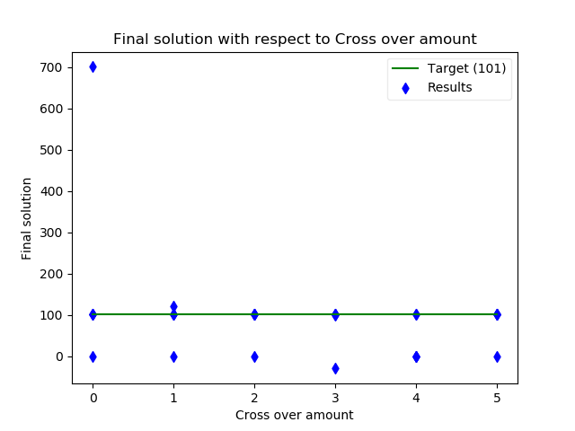
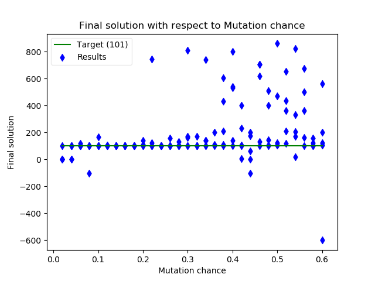
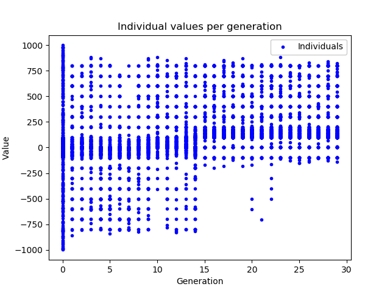
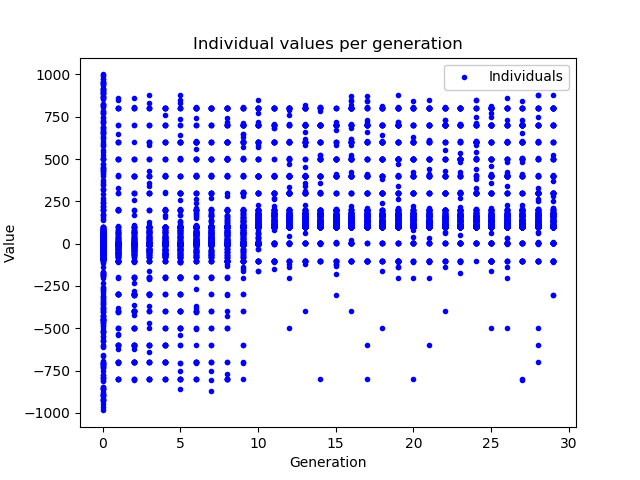
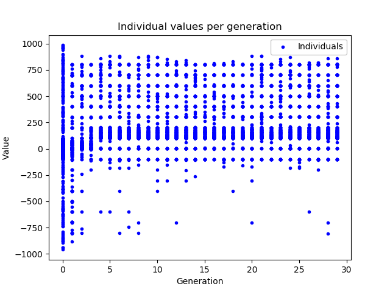

# Genetic Algorithms

_Source code: [notebook](./geneticAlgorithm.ipynb) or [python script](./geneticAlgorithm.py)_

Being stochastic, GA's will create different graphs each time but they will be very similar with the same settings.

## Abstract

I have made a generalised `genetic_algorithm` function in the [metaheuristics module](../../modules/metaheuristics.py#L139) which can take in many parameters.

Throughout testing I found that the 2 minima picked up by the genetic algorithm are 0 and 101, and I have shown that 101 is the best solution out of the two; so for the rest of this I will refer to 101 as the global minimum and 0 as the local minimum. (see the conclusion)

## Default GA

With the [default](./geneticAlgorithm.py#L197) starting parameters, you get something like this:

")

")

The early generations tend to have the fittest individuals closer to the local minima at 0, because the trough is more spread out so theres a higher probability that individuals will be their when they are initially randomly generated. However, with cross-over and mutation there start to be more individuals which find the global minima at 101 and because these then become the fittest more individuals in later generations settle at the global minimum.

## The algorithm by hand (first few iterations)

Starting with the [default](./geneticAlgorithm.py#L197) parameters:

- `population_size`: the population size per generation.
- `epochs`: the amount of epochs or generations of individuals. An [individual](./geneticAlgorithm.py#L133) is a class which I made to store the dna, generation and value of an instance of the population.
- `fitness_upper_bound`: The proportion of the population which survive to breed.
- `selection_function`: The way which couples of individuals are selected to pass down their dna.
- `mutation_chance`: The chance that a digit in the dna of an individual can randomly change from its parents.
- `sign_change_chance`: The chance that the sign part of the dna of an individual can randomly change from its parents.
- `cross_over_amount`: The amount of cross over that occurs when dna is combined from parent individuals.

Here are some constants which will be unchanged throughout as they are fundamental about GA's and the problem:

- `fitness_function`: the problem 1 function (imported from [problem_function](../../modules/problem_function.py) module)
- `breed_individuals`: the function ([source](./geneticAlgorithm.py#L164)) which unpacks the generation and dna from 2 individuals and first uses cross-over and then mutation on them to output a new individual with inherited dna and an incremented generation number.

### Representing the decimal values as dna

In GA's the values of a problem need to be partitioned into many units, this is so that cross-over and mutation can create new values by making slight changes to this structure.

I first considered using binary and as I wanted to represent real numbers in my search space I tried implementing a floating point binary dna structure.

(Float diagram, see references)

What became clear though was that the search space would be very large and that a small change in 1 bit of a float can dramatically change the value of the float; especially in the first 2 bytes of it. Also there was the problem that cross-over between floats of with different exponents would create values wildly different to the original values.

Instead I decided to use a much more simplistic character array dna structure (1 sign, 1 decimal place and 6 digits).

`["s", "x", "x", "x", ".", "x", "x", "x"]`

(where `x` are digits, `s` is the sign and the `.` is the decimal place)

So: `-111.222` would be `["-", "1", "1", "1", ".", "2", "2", "2"]`

With this system I have a search space between -999.999 and 999.999 which is accurate to 3 decimal places; which is fine for the problem.

### Mutation

In a GA for it to diversify there needs to be a slight chance of a mutation in the dna.

The mutation function I use has some chance (`sign_change_chance`) that the sign character will change to the other sign character, and another chance (`mutation_chance`) that is applied to each digit character that that character will change to another random character.

### Cross-over

In a GA cross-over is how 2 dna structures pass down some of their data to the next generation.

Random cross-over points are selected and a one of the dna strands is picked randomly to start with.

Then the data of the selected strand is copied into a new stand until a cross-over point is reached where dna is instead copied from the other strand.

### Example by hand of the GA

For the example I'll use a population size of 6 and a cross-over amount of 2.

- Create a population of random starting values in the search space.
  - `[0.100, 300.500, 120.000, 23.540, -964.000, -63.902]` (for example)
- For the amount of epochs/generations:
  - Sort the population by their value through with the fitness function.
    - fitnesses: `[-1.000, 39798.882, 359.632, -0.946, 0.000, -0.665]`
    - so sorted values are: `[0.100, 23.540, -63.902, -964.000, 120.000, 300.500]`
  - Remove the individuals from the population which are under the pass criteria (set by the `fitness_upper_bound`)
    - lets say that fitness upper-bound is top 4/6 so: `[0.100, 23.540, -63.902, -964.000]`
  - Then for the remaining population produce 6 new offspring by having 2 couples produce `2/fitness_upper_bound` offspring each (so 3).
    - selecting `0.100` and `23.540`
      - cross-over yields `3.500`
      - mutation changes this to `103.500`
      - The fore-mentioned happens another 2 times to produce: `103.500`, `23.1` and `0.34`
    - selecting `-63.902` and `-964.000`
      - cross-over yields `-963.900`
      - mutation changes this to `-903.900`
      - The fore-mentioned happens another 2 times to produce: `-903.900`, `-63.000` and `-974.002`
  - The next generations population is `[103.500, 23.1, 0.34, -903.900, -63.000, -974.002]` which replaces the old one.

## Population size

Through testing the GA when changing only population size I have found that larger populations (around 800 individuals or more) tend to get the best results. However, when you increase the number of individuals computation increases making it more time consuming.

Therefore, I decided in subsequent tests to fix my popultion size parameter at 1000 because I can be fairly sure that I'm getting a good result and increasing the population past this would only make the algorithm slower.

## Fitness upper-bound

This is a parameter that I have made up, in my GA design I have a sortof [truncation selection](http://nitro.biosci.arizona.edu/zbook/NewVolume_2/pdf/WLChapter14.pdf), what I use it for is the percentage of the population which get a chance to be selected (keeping the fittest and removing the rest).

When my default selection function is used, the GA is using truncation selection; since my default selection function will choose all of the remaining population after the truncation.

I found that I got a high proportion of results at the global minima when the "fitness upper-bound" was less than 30% and I got a high proportion of results at the local minima when it was greater than 70%.

In subsequent tests I fixed fitness upper-bound to 0.2.

## Number of Epochs / Generations

The number of generations of populations produced.

I found that testing from 15-150 generations didn't affect the results significantly.

I fixed the number of epochs at 30 for subseqent tests.

## Cross-over amount

For this I varied the amount of cross-over, between none and 5; running 5 GAs for each.

I found that cross-over values of 1 and 2 performed best with my dna model, but not by much; because the results didn't correlate very well at all.

I fixed cross-over to 1 for subsequent tests.

## Mutation chance

This time I varied the chance that any digit character in the dna structure can randomly change.

I found that a balance is necessary where percentages 5% or lower tend to not be enough to find to global minimum, percentages higher than 15% would tend to give end results which were less accurate (didn't land on any minima); but percentages around 10% tend to find the global minimum more consistantly.

I fixed mutation chance to 0.1 (10%) following these findings.

## Selection method

_Note: generations in this algorithm start counting from 0_

I wrote 3 selection functions based upon selection methods I researched online (Blinkie and Thiele, 1995), they are:

- Truncation selection (the default one I use)
- Fitness proportionate selection
- Tournament selection

### Truncation selection

After 16 generations the high density of the population shifts upto the global minimum from the local minimum.

### Fitness proportionate selection

After 12 generations the high density of the population shifts upto the global minimum from the local minimum.

### Tournament selection

After 5 generations the high density of the population shifts upto the global minimum from the local minimum.

Thus tournament selection seems to be the best selection method since it finds the best solution in the least amount of generations.

## Conclusion

GA's although computationally expensive, don't get easily trapped in local minima and don't suffer from the problem of where to start like other methods do, since it is population based; as the population affectively starts spread out across the entire search space.

To summarise, the best parameters for the GA over testing were:

- A large but not excessive **population size** (around **1000** individuals)
- I decided to truncate my population by the **fittest 20%** (200 individuals) for the next generation produced 10 children per 100 pairs of parents; to maintain population size.
- The **number of generations** didn't need to be very large for this due to the population size and other factors so I reduced the number of epochs/generations **from 50 to 30**, as this reduced the amount of computation for the rest of the batch tests.
- The amount of **cross over** was most consistent at **1**.
- The chance of **mutation** didn't need to be high at all with a **chance of 10%** being about right.
- The **selection function** quickest at zoning in the population on the global maximum was the **tournament selection** function.

To further improve this GA I would make a better mutation function which would mean a less eratic change in the values encoded by the dna structure.

## References

(Blinkie and Thiele, 1995) - Blinkie, T. and Thiele, L. (1995). A Comparison of Selection Schemes used in Genetic Algorithms. 2nd ed. [ebook] Zurich: Swiss Federal Institute of Technology, pp.14, 23, 40. Available at: https://www.tik.ee.ethz.ch/file/6c0e384dceb283cd4301339a895b72b8/TIK-Report11.pdf [Accessed 6 Dec. 2018].

(Float diagram) - http://www.puntoflotante.net/FLOATING-POINT-FORMAT-IEEE-754.htm [Accessed 3 Jan. 2019]
